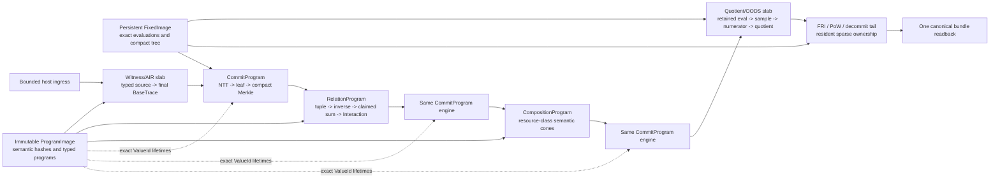

# SN2 single-H100 8–12 useful-MHz slab rewrite

**Date:** 2026-07-19

**Status:** future implementation specification; the 5-MHz checkpoint is measured,
but 8–12 MHz is not yet a forecast or promotion claim

**Production baseline:** `stwo` `526b489d`, `stwo-cairo` `be3e7e55`

**Measured checkpoint:** 1.479474910 seconds / 5.209 useful MHz median

**Scope:** production CUDA data plane, memory ownership, and exact prover
semantics; no harness or control-plane work

## 1. Executive contract

The current backend has crossed 5 useful MHz on one complete, byte-identical SN2
proof. The next large performance step cannot come from receipt hashing, graph
submission, allocation tuning, or launch-constant sweeps. It requires replacing
the dominant *slabs*: transcript-bounded regions that own a mathematical
transformation, its materialized buffers, its global-memory passes, and the final
reader of those buffers.

The required direction is:

1. compile each proof shape into immutable, typed slab programs;
2. make every large value have one producer, one physical owner, and a proven
   final reader;
3. delete layout adapters, global scratch images, and repeated transforms between
   adjacent producers and consumers;
4. split kernels by semantic dependency cone and resource class rather than using
   universal high-register or high-shared-memory kernels;
5. validate every changed intermediate against an independent reference before it
   can affect a transcript challenge;
6. measure the complete recurring slab and then the complete proof on the same
   source and physical GPU.

The 8–12 MHz range is a strong architectural research envelope because it requires
approximately 35–57% less complete wall time from the current checkpoint. It is
not defensible as a prediction until a fresh current-binary event, Systems, and
selected-counter profile establishes physical floors for the rewritten slabs.

## 2. Verified starting point

SN2 contains **7,706,864 useful steps**. The current production path selected
`staged-group-direct` and ran through the `ReplacementV1` ArenaGraph.

| Field | Verified value |
|---|---:|
| Raw warm samples | 1.479474910, 1.467947317, 1.479955339, 1.477843392, 1.482114914 s |
| Raw warm median | **1.479474910 s** |
| Raw warm p95 | **1.482114914 s** |
| Reported median rate | **5.209 useful MHz** |
| Reported p95 rate | **5.201 useful MHz** |
| Verified repetitions | **6/6** |
| Fresh SIMD/GPU proof bytes | **equal** |
| Structured mutation | **rejected** |
| Proof size | 3,078,795 bytes |
| Proof SHA-256 | `99bf0cd0863658742ada152caee238d888f5c901dc7e4df66f2748d49cea98da` |
| Total host preparation | **38.393575 ms** |
| Session preparation | **34.584541 ms** |
| Ingest preparation | **3.809034 ms** |
| Graph launches | 14 |
| Kernel launches | 2,119 |
| Hot allocations / frees | 0 / 0 |
| Warm host synchronizations | 1 |
| Warm graph-submit gaps | 0.199704 ms total; 0.150163 ms maximum |
| Witness H2D | 95,728,780 bytes in 21 copies |
| Execution-table H2D | 66,355,840 bytes in 3 copies |
| Composition refresh H2D | 14,672 bytes in 58 copies |

The source and hardware identity were:

- `stwo` `526b489db96a23fb9d044dc3fe61f839a6062f67`;
- `stwo-cairo` `be3e7e550f892909a912e04ebc0ac8fb65ed40cc`;
- `gpu_bench` SHA-256
  `0a4051aa83fb3625ec8cc3a5803b9de841ae78a588164cf529ab1db2bb8cc504`;
- 340/340 required SM90 AOT entries;
- H100 80 GB HBM3, UUID
  `GPU-80ef4dbd-d519-8e2c-5371-e896869030cb`;
- driver 580.126.09, CUDA 11.8, 700 W, maximum 1,980 MHz SM and
  2,619 MHz memory clocks.

The complete receipt is in
[`../results/h100-statement-upload-scan-removal-20260719/`](../results/h100-statement-upload-scan-removal-20260719/).
The graph, ingress, Composition, commitment, quotient, policy, and memory fields
used below are projected into the tracked
[`architecture_receipt.json`](../results/h100-statement-upload-scan-removal-20260719/architecture_receipt.json).
It is an iteration result rather than formal promotion because counters were
unavailable, the physical-memory ledger was incomplete, and the previous result
used a different physical H100.

## 3. Exact wall budgets

The following arithmetic starts from the new 1.479474910-second verified median.
It supersedes budgets based on the earlier 1.597542116-second checkpoint.

| Target | Maximum complete wall | Reduction required | Complete-wall cut | Speedup required |
|---|---:|---:|---:|---:|
| 8 MHz | **963.358000 ms** | **516.116910 ms** | **34.885%** | **1.5357x** |
| 10 MHz | **770.686400 ms** | **708.788510 ms** | **47.908%** | **1.9197x** |
| 12 MHz | **642.238667 ms** | **837.236243 ms** | **56.590%** | **2.3036x** |

If the currently measured 38.393575 ms of host preparation is held constant, the
remaining device/system budget is:

| Target | Device/system allowance after current host prep | Cut from current 1,441.081335 ms remainder |
|---|---:|---:|
| 8 MHz | **924.964425 ms** | **35.815%** |
| 10 MHz | **732.292825 ms** | **49.184%** |
| 12 MHz | **603.845092 ms** | **58.098%** |

Host preparation is no longer a headline lever. Even eliminating all 38.394 ms
would supply only 7.4% of the 8-MHz gap and 4.6% of the 12-MHz gap. Likewise,
approximately 0.200 ms of final-warm-sample graph-submit gaps and zero hot
allocations show that generic submit and allocator tuning cannot close a material
share of the gap.

## 4. What a slab means

A slab is not a file or a kernel family. It is the complete causal region from
typed input ownership to the next transcript-visible or long-lived output:

```text
typed inputs
  -> transformations
  -> materialized intermediates
  -> commitments / claimed sums / samples
  -> final readers and releases
```

Its cost includes:

- every kernel and copy in the region;
- every full or partial global-memory pass;
- descriptor and launch work that recurs per proof;
- scratch and retained-buffer lifetimes;
- synchronization and stream dependencies;
- work shifted into a predecessor or successor by fusion.

A candidate wins only when this expanded boundary gets faster. A lower kernel
time that moves work outside the timer is not a slab win.

## 5. Evidence classes and non-double-counting

### 5.1 Class A — current complete-proof evidence

The 1.479474910-second result and its production receipt are the only current
absolute wall baseline. Current receipt facts such as 2,119 launches, zero hot
allocations, Composition traffic, and quotient-B2N traffic describe the exact
selected source.

### 5.2 Class B — earlier H100 family ranking

An earlier eager diagnostic observed 2.441872 seconds of summed kernel time and
96.811% GPU activity. It ranked:

| Family | Earlier diagnostic kernel sum |
|---|---:|
| Total NTT/LDE/commitment | 1,295.574 ms |
| Rejected fixed-16 terminal N2B + hash | 965.609 ms |
| Quotient/numerator | 335.056 ms |
| Composition | 311.464 ms |
| Relation/LogUp | 199.842 ms |
| PoW | 117.826 ms |
| Witness/base AIR | 107.722 ms |
| OODS | 67.468 ms |

These rows rank defect classes only. That source used a later-withdrawn fixed-16
terminal path, eager execution, and the pre-run-sum numerator. None of these
milliseconds may be subtracted from the current wall.

### 5.3 Class C — A40 component evidence

A40 results identify portable CUDA defects and reject losing shapes:

- adaptive Relation: 0.928x eager / 0.927x captured, rejected on A40;
- prepacked Quotient: 0.273–0.320x, rejected on A40;
- SN3 group-direct numerator: 1.3240x, 20/20 paired wins;
- numerator-to-FRI boundary: 1.3045x;
- scoped archive LTO: at least 1.1614x on its exact boundary;
- paired-row run-aware numerator: 1.1201x.

They do not scale into H100 milliseconds and do not qualify an H100 architecture.
They are design selection evidence.

### 5.4 Explicit double-counting register

Never add both sides of any row below:

| Overlap | Why it is one credit |
|---|---|
| Current run-sum full-proof delta and older quotient/numerator family time | Run-sum already changed that family |
| Terminal fusion traffic and unified commitment traffic | Both can retire the same global passes |
| Lower registers and deleted passes in one kernel | Resource and traffic effects produce one measured wall delta |
| Relation atomics and witness reductions after fusion | The shared reduction can have only one owner |
| Summed kernel durations and overlapped critical-path time | Overlap makes sums exceed wall |
| Host CUDA wait and the underlying device work | The wait is not independent work |
| H100 and A40 ratios | Different architectures cannot form one speedup |
| TMA/cluster and portable SIMT versions | They are alternative implementations |
| PoW samples with different nonce luck | Random search length is not an architectural saving |
| Removed content hashing and later pinned-copy overlap | Both may occupy the same host interval |

## 6. Current and target architecture

### 6.1 Current physical pattern

```mermaid
flowchart LR
    I[Host statement and witness inputs] --> W[Witness and Base AIR kernels]
    W --> WB[Lookup and subcomponent bridge images]
    WB --> BT[Base trace]
    BT --> BC[Base NTT / LDE / leaf / Merkle variants]
    BC --> R[Relation and LogUp segmented program]
    R --> IT[Interaction trace]
    IT --> IC[Interaction NTT / LDE / leaf / Merkle variants]
    IC --> C[18 Composition dependency waves]
    C --> CS[Split / forward / retained Composition image]
    CS --> CC[Composition commitment variant]
    CC --> O[OODS cohorts]
    O --> Q[Group-direct run-sum numerator and quotient B2N]
    Q --> F[FRI folds and commitments]
    F --> P[PoW]
    P --> D[Query and decommit gathers]
    D --> B[Canonical proof bundle and bounded D2H]

    FIX[Fixed/preprocessed coefficients] --> BC
    FIX --> O
    FIX --> Q
    FIX --> D
```



The main defects are repeated transform/commit variants, bridge images between
witness producers and consumers, high-live-range Composition waves, segmented
Relation ownership, and coefficient-backed re-evaluation where exact persistent
evaluations should be shared.

### 6.2 Target physical pattern



`ProgramImage` describes immutable algebra and topology. `FixedImage` owns
preprocessed evaluations and compact commitment data that are genuinely reusable.
One shape executable owns physical allocations, streams, events, and graphs.
Neither image may cache statement-dependent proof results.

## 7. Slab atlas

| Priority | Slab | Current evidence | Rewrite objective |
|---:|---|---|---|
| 1 | Unified commitment / NTT / LDE / Merkle | largest earlier family; fragmented production variants | one transform-to-compact-tree ownership program |
| 2 | Composition | 18 waves; three earlier hot kernels at 255/255/179 registers | split semantic cones; keep values resident without collapsing occupancy |
| 3 | Witness / Base AIR | large bridge images and global feeds; 95.7 MB ingress remains | typed device production directly into final BaseTrace and relation sources |
| 4 | Relation / LogUp | production policy still `segmented`; losing generic adaptive attempt | shape/resource queues and deterministic hierarchical reductions |
| 5 | Quotient / numerator / OODS | run-sum is already a major winner; 2.55 GB partial reads remain | preserve winner; retire residual coefficient/re-evaluation seams |
| 6 | PoW / query / decommit / bundle | PoW and final sparse ownership are material; FRI fold is small | disjoint nonce lattice and direct resident sparse assembly |
| cross-cutting | Value lifetimes / arena ownership | physical ledger incomplete; several retained and scratch images | one producer, final-reader proof, alias coloring, immediate release |

## 8. Slab 1 — unified commitment, NTT/LDE, and Merkle

### 8.1 Current defect

Base, Interaction, Composition, and later PCS work share the same fundamental
transform-to-tree pipeline but still use distinct progressive, materialized, and
terminal paths. The old fixed-16 experiment is the clearest anti-pattern:
15 launches consumed 965.609 ms while CTAs serialized sixteen columns and reserved
34,816–143,360 bytes of dynamic shared memory. The 143,360-byte shape admitted only
one CTA on H100.

The direct-LDE study counted 236.508 GiB of logical transform traffic. Its first
production step deleted 28.304 GiB and 53 launches, only 11.968% of the traffic.
That is useful progress, but most transform and commitment ownership remains.

The current receipt reports two direct Base/Interaction commitments, compact-h8
retention, zero separate interpolation graphs, and 36 materialized terminal
batches. The rejected fixed-16 path is no longer selected.

### 8.2 Rewrite

Replace the parallel commitment implementations with one compiled `CommitProgram`
whose queues are keyed by:

- transform log and radix schedule;
- source and destination representation;
- number of columns and column stride;
- leaf packing and duplicate-first policy;
- compact-tree retention depth;
- final coefficient and evaluation readers;
- target-SM resource class.

The physical pipeline should:

1. assign columns or narrow column groups independently across warps and CTAs;
2. perform the last NTT stages into the exact layout consumed by leaf hashing;
3. eliminate layout-adapter write/read passes;
4. hash leaves and interior subtrees with bounded warp/shared tiles;
5. publish the root and retained compact layers once;
6. retain coefficient or evaluation images only through their actual OODS,
   numerator, or decommit final reader;
7. use one out-of-place destination unless an in-place overwrite proof covers
   every future read.

Do not recreate a CTA that walks a wide column tile serially. Do not fuse the
whole tree into a resource-heavy mega-kernel. The unit of fusion is the largest
producer/consumer tile whose values stay in registers or bounded shared memory
without reducing useful residency.

### 8.3 Target-specific implementation

- `sm_86` / `sm_89`: portable SIMT baseline using warp shuffles and bounded shared
  tiles.
- `sm_90`: compare the portable baseline with TMA and thread-block-cluster variants
  only when the tile has measured reuse and correct barrier/proxy semantics.
- `sm_120`: compile and tune separately; never infer resource behavior from H100.

TMA is admissible only with exact alignment, stride, transaction-byte, mbarrier,
proxy-fence, wait, and destination-visibility proofs. A lower instruction count is
not a win if the complete commitment slab does not move.

### 8.4 Correctness obligations

- canonical circle-domain and NTT permutation;
- exact M31/QM31 coordinate and limb representation;
- exact duplicate-first expansion;
- exact leaf byte stream and absorption order;
- every retained evaluation and Merkle layer byte-identical;
- root equality for eager, captured, and changed-input executions;
- coefficients released only after all OODS, numerator, and decommit readers;
- final proof bytes, verifier, and mutation gates.

### 8.5 Primary code frontier

- `crates/backend-cuda/src/backend/commit_graph.rs`;
- `crates/backend-cuda/src/backend/prepared_progressive_commit.rs`;
- `crates/backend-cuda-kernels/cuda/progressive_commit_in_place.cu`;
- `crates/backend-cuda-kernels/cuda/ntt_leaf_fused.cu`;
- `crates/backend-cuda-kernels/cuda/ntt_compact_leaf.cuh`;
- `crates/backend-cuda-kernels/cuda/blake2s.cu`;
- Stwo-Cairo `arena_plan.rs` and commitment policy binding.

## 9. Slab 2 — Composition

### 9.1 Current defect

The production program executes **18 dependency waves**. The current split receipt
reports:

| Composition fact | Current value |
|---|---:|
| Current logical traffic | 6,174,015,488 bytes |
| Executed/fused logical traffic | **4,026,531,840 bytes** |
| Current D2D nodes | 8 |
| Executed kernels | 5 |
| Retained image | 536,870,912 bytes |
| Source image | 268,435,456 bytes |
| Terminal fallback comparison | 6 launches / 5,100,273,664 bytes |

The earlier diagnostic measured 311.464 ms total. Its three largest generated
kernels were approximately 149.715 ms at 255 registers/thread, 48.724 ms at
255 registers/thread, and 38.492 ms at 179 registers/thread. Those three kernels
were 76% of that family. This is a dependency-cone and live-range problem, not a
launch-overhead problem.

An ordinary cap-128 stripe is not the final answer: it lowers registers but adds
many launches and global passes. It is only a diagnostic that helps identify where
shorter live ranges can win.

### 9.2 Rewrite

Compile the AIR dependency DAG into semantic cones with explicit producer and
consumer ownership:

1. locate the three hot cones from semantic hash to loaded function;
2. split only at values whose reduced live range repays staging or recomputation;
3. preserve shared subexpressions inside one resource-qualified cone;
4. retile separately for M31-heavy, QM31-heavy, lookup-heavy, and high-source-count
   shapes;
5. use fast M31 paths only after algebraic and SASS validation;
6. keep the accumulator resident across adjacent terms where canonical order allows;
7. publish the four extension coordinates directly into the retained Composition
   evaluation image;
8. hand that image directly to the unified commitment program.

The goal is not one kernel per constraint and not one kernel for all constraints.
It is the smallest set of resource-stable cones that delete spills and global
accumulator traffic together.

### 9.3 Correctness obligations

- semantic and AOT hashes bind the exact constraint DAG;
- canonical constraint and coefficient order;
- exact coefficient spans at every split;
- exact four QM31 coordinates;
- exact output columns, retained evaluation, commitment root, OODS values, and
  final proof;
- no fallback to the old wave path inside a promoted result.

### 9.4 Primary code frontier

- `crates/backend-cuda/src/backend/jit/cuda_codegen.rs`;
- `crates/backend-cuda/src/backend/aot.rs`;
- `crates/backend-cuda-kernels/cuda/composition.cu`;
- Stwo-Cairo `resident_composition.rs`, `composition_plan.rs`, and
  `composition_wave.rs`.

## 10. Slab 3 — witness and Base AIR

### 10.1 Current defect

The current backend still materializes generic witness structures that are later
bridged or reinterpreted. Historical isolated evidence measured 193 launches and
462.546 ms for the larger witness region:

| Historical subfamily | Time |
|---|---:|
| AIR kernels | 248.080 ms |
| `ec_op` | 84.030 ms |
| Recorded witness | 70.711 ms |
| Feed/count work | 49.843 ms |
| Input materialization | 9.882 ms |

That source is not the current wall, but the data model exposes the problem:

| Logical image | Approximate size |
|---|---:|
| BaseTrace | 7.003 GB |
| LookupInputs | 16.624 GB |
| SubcomponentInputs | 3.001 GB |
| WitnessInput | 1.014 GB |
| Compaction images | 1.547 GB |

Three bridge families contain 20,638,950,592 bytes. One full global write and
reread is 41,277,901,184 logical bytes. The current proof also ingests
95,728,780 witness bytes in 21 H2D copies.

### 10.2 Rewrite

Generate a typed witness/AIR program from the canonical component generator:

1. group operations by mathematical component, log, row mapping, and resource
   class;
2. write final BaseTrace columns directly;
3. replace lookup and subcomponent bridge images with typed lazy source expressions
   or direct writes into the sole consumer;
4. give EC, Poseidon, Blake, memory, and ordinary components separate kernels when
   their resource profiles differ;
5. make feed/count reductions deterministic warp-to-CTA-to-global operations only
   where the measured contention distribution beats the current global atomics;
6. keep the global-atomic path as control until a complete same-shape boundary wins;
7. retain only statement ingress that cannot be generated or reused on device.

Do not create a universal witness mega-kernel. It will combine unrelated live
ranges, inflate registers, and make correctness localization harder.

### 10.3 Correctness obligations

- every component row equals the independent SIMD writer;
- exact tuple ordinal, relation ID, enabler, multiplicity, and padding;
- exact BaseTrace column and row order;
- exact EC exceptional cases and device fp256 arithmetic;
- no dropped, duplicated, or reordered feed contribution;
- deterministic bytes across CTA scheduling, eager, and graph replay;
- limb-level device oracles before any PTX or carry-chain change.

### 10.4 Primary code frontier

- `crates/backend-cuda-kernels/cuda/generated/`;
- `witness_feed_counts.cu`;
- `witness_edge_gather.cu`;
- `memory_witness.cu`;
- Stwo-Cairo `resident_witness.rs` and generated witness lowering.

## 11. Slab 4 — Relation and LogUp

### 11.1 Current defect

The current production receipt still selects `gpu_policy_relation_tail_mode =
segmented` and `gpu_policy_witness_feed_launch_mode = global-atomics`.

The earlier diagnostic assigned 199.842 ms to Relation/LogUp. Its main fused
family consumed 162.664 ms with:

- 82 registers/thread;
- 256 threads/CTA;
- 24,560 bytes dynamic shared memory;
- 150,748 blocks.

The later adaptive Relation candidate was about 8% slower on A40 despite passing
correctness. That result rejects the specific generic adaptive shape, not the
need to replace segmented ownership.

### 11.2 Rewrite

Compile exact relation instances into shape and resource queues:

1. bind tuple sources, multiplicities, enablers, `z`, and `alpha` statically;
2. load each source once per owned row where reuse is real;
3. keep denominator construction and inversion consumption local where profitable;
4. write final Interaction columns directly;
5. replace global atomics with deterministic warp/CTA partials only for shapes whose
   contention and reduction size justify it;
6. use separate narrow-tuple and wide-tuple kernels;
7. replace the segmented scan tail with a hierarchical scan only if a fresh profile
   says the scan remains material;
8. bind fallback eligibility into immutable program identity.

### 11.3 Correctness obligations

- exact tuple source and multiplicity provenance;
- exact canonical term, `z`, and `alpha` order;
- exact zero-denominator and `inv(0)` convention;
- exact claimed sums;
- exact scan and shift order;
- deterministic results across eager, capture, and alternate CTA scheduling.

### 11.4 Primary code frontier

- `relation_fused.cu`;
- `relation_blake_g_inputs.cu`;
- `relation_scan.cu`;
- Stwo-Cairo `relation_execution.rs` and relation-program lowering.

## 12. Slab 5 — quotient, numerator, and OODS

### 12.1 Preserve the measured winner

This slab has already produced the largest current architectural win. The
same-binary H100 comparison was:

| Path | Raw warm median | Useful MHz |
|---|---:|---:|
| Packed control | 1.903122776 s | 4.050 |
| Group-direct run-sum | **1.597542116 s** | **4.824** |
| Complete-wall delta | **-305.580660 ms** | **1.1913x** |

Do not replace run-sum with a generic “cleaner” engine. Extend its ownership.

The current quotient-producer-to-B2N receipt reports:

| Fact | Value |
|---|---:|
| Fused launches | 3 |
| Fallback launches | 24 |
| Launches eliminated | **21** |
| Fused logical bytes | 671,088,640 |
| Fallback logical bytes | 6,308,233,216 |
| Logical bytes eliminated | **5,637,144,576** |
| Unchanged partial-read bytes | **2,550,136,832** |
| Denominator factors | 159,383,552 |
| Chunk-8 inverse calls | 25,165,824 |

### 12.2 Remaining rewrite

1. preserve native run-sum, group-direct ordering, and the fused B2N producer;
2. eliminate the remaining coefficient-backed preprocessed group by serving exact
   evaluations from persistent `FixedImage`;
3. group OODS work by log, domain, source layout, and point so weights and source
   reads are reused;
4. consume quotient inverses locally when that wins over global batch-inverse
   scratch;
5. retire the remaining 2.55 GB partial-read seam where producer/consumer liveness
   permits;
6. feed the final quotient layout directly into FRI ingress.

The prior A40 prepacked quotient candidate is permanently rejected in its measured
shape. Do not retune it.

### 12.3 Correctness obligations

- exact source domain, log, row projection, and sample order;
- exact numerator accumulation order and four final coordinates;
- exact quotient order and FRI input;
- non-aliasing victim/source lifetimes for run-sum scratch;
- fixed evaluations equal legacy coefficient evaluation at every observed point;
- eager, captured, changed-input, and post-timing equality.

### 12.4 Primary code frontier

- `quotient_numerator_native_run_sum.cu`;
- `quotient_numerator_single_write.cu`;
- `prepared_quotient_numerator/run_sum.rs`;
- `prepared_quotient.rs`;
- `quotients.cu`;
- `oods.cu` and `oods_collapsed.cu`;
- Stwo-Cairo numerator policy, `FixedImage`, and final-reader binding.

## 13. Slab 6 — PoW, query, decommit, and proof bundle

### 13.1 Current priority

The older qualified final graph was 172.037 ms across 952 nodes. The later
diagnostic attributed 117.826 ms to PoW, while FRI folding itself was only
2.441 ms. FRI arithmetic is therefore not a current priority unless the fresh
current-source profile reverses that ranking.

### 13.2 Rewrite

1. partition the resident nonce lattice into disjoint ordinal ranges;
2. reduce candidates to the canonical minimum valid ordinal, independent of CTA
   completion order;
3. retain queryable compact-tree and evaluation ownership through decommit;
4. drive sparse gathers directly from canonical query indices;
5. eliminate normalization or staging images whose sole reader is bundle assembly;
6. assemble the proof bundle once in canonical order;
7. use one bounded final D2H readback.

PoW measurement must compare a fixed or statistically controlled search workload.
A lucky nonce is not a kernel win.

### 13.3 Correctness obligations

- complete, non-overlapping nonce ordinal coverage;
- canonical minimum and tie behavior;
- exact query and authentication-sibling order;
- exact proof-bundle encoding;
- verifier acceptance and prescribed mutation rejection.

### 13.4 Primary code frontier

- `resident_pow.cu`;
- `decommit.cu`;
- `fri_fold_fused.cu`;
- PCS query/decommit ownership and final bundle assembly.

## 14. Cross-cutting memory and lifetime rewrite

The current arena owns **10,203,919,648 four-byte words =
40,815,678,592 bytes / 38.013 GiB**. Separately, the complete process reports
approximately **43.676 GB peak VRAM**. Formal physical admission is incomplete
because context, module/global, graph/event, profiler, and policy-reserve rows are
missing.

Every slab rewrite must compile a `ValueId` lifetime graph:

```text
ValueId:
  semantic owner
  physical allocation
  byte extent and alignment
  producer event
  every consumer event
  final reader
  overwrite / alias rule
  release event
  transcript visibility
```

The allocator may color two values together only when their event-ordered lifetimes
are disjoint and the later producer performs the mandatory overwrite before any
read. A borrowed alias needs the same proof. Logical bytes, whole allocations,
allocator-reserved bytes, context/module/graph bytes, and operational reserve must
remain separate.

Delete a bridge buffer only after proving:

1. the producer can emit the consumer layout;
2. no other reader needs the old layout;
3. transcript-visible bytes remain canonical;
4. eager and captured event order is sufficient;
5. peak physical memory does not regress elsewhere.

## 15. Portfolio needed at each target

These are dependency portfolios, not additive forecasts.

### 15.1 Eight MHz

Required complete-wall reduction: **516.117 ms**.

The credible minimum portfolio is:

- unified commitment/NTT/Merkle ownership;
- split and retiled hot Composition cones;
- at least one material witness/Relation bridge or reduction deletion;
- the existing run-sum and host-scan wins preserved.

Composition alone cannot close the gap. The earlier three hot Composition kernels
contained only about 237 ms total before any achievable residual, and those
milliseconds came from a different source.

### 15.2 Ten MHz

Required complete-wall reduction: **708.789 ms**.

The credible portfolio is:

- commitment/NTT/Merkle rewrite;
- Composition rewrite;
- witness direct production;
- Relation/LogUp queues and reductions;
- residual quotient/OODS evaluation ownership;
- exact lifetime coloring across those regions.

Before implementation can claim this target is physically feasible, a current
counter-backed model should place the device/system critical path materially below
732.293 ms. A **predeclared engineering-margin choice** of roughly 650–670 ms
would leave integration and sampling headroom; it is neither derived physical
evidence nor a result.

### 15.3 Twelve MHz

Required complete-wall reduction: **837.236 ms**.

Twelve MHz requires all dominant slabs plus the tail. A counter-backed physical
model should place the device/system floor below 603.845 ms. A **predeclared
engineering-margin choice** of 520–540 ms before substantial implementation spend
would reserve integration and sampling headroom; it is not a measured floor. If
immutable outside-slab time plus measured stage floors exceed the target, record a
formal single-H100 no-go and move the headline to cooperative same-proof GPUs.

## 16. Required CUDA and prover skills

Generic CUDA competence is insufficient. The work needs CUDA/HPC depth *and*
executable STWO domain knowledge.

| Required knowledge | Required practical depth | Concrete artifact |
|---|---|---|
| STARK and Fiat–Shamir soundness | transcript barriers, field/circle domains, OODS, quotient, FRI, Merkle encoding | per-slab semantic contract and observable matrix |
| NTT/LDE | canonical permutation, radix scheduling, in-place hazards, column batching | pass-minimal schedule plus transformed-column oracle |
| Blake2s/Merkle | byte packing, leaf absorption, subtree ownership, compact retention | direct NTT-to-leaf/tree program with every layer equal |
| AIR compiler | dependency DAG, semantic hash, code generation, resource-aware splits | reproducible Composition and witness programs |
| Relation/LogUp | tuple provenance, inversion, scan, zero denominator, claimed sums | deterministic relation program and adversarial oracle |
| CUDA SIMT | warp/CTA ownership, coalescing, shared banks, occupancy, divergence, barriers | shape-specific kernel design and resource receipt |
| CUDA asynchronous memory | LDGSTS, TMA, mbarriers, proxy fences, clusters | target-specific implementation with memory-model proof |
| Compiler/SASS | ptxas resources, live ranges, spills, LTO, instruction pipelines | exact loaded-cubin SASS and resource comparison |
| Field arithmetic/PTX | modular reduction, fp256 limbs and carry chains | hardware fuzz oracle plus indivisible, constrained PTX where unavoidable |
| GPU memory ownership | ValueId liveness, alias coloring, final readers, stream/event order | physical lifetime and pass/byte graph |
| Performance science | CUDA events, Systems, NCU, roofline, ABBA/UCB95 | causal counter evidence and same-GPU decision |
| Formal validation | reference oracles, sanitizers, eager/capture, changed input, verifier/mutation | exact intermediate and proof-byte gates |

### 16.1 Existing workspace-local skill coverage

The shared `stark-proving` workspace contains the following generic CUDA
foundation. These files are external to this Stwo-Cairo Git repository; their
requirements are reproduced in this specification so the architecture remains
self-contained on GitHub.

| Skill | Status |
|---|---|
| `.codex/skills/gpu-prover-measure` | ready for profiling, statistics, pass/byte/issue/dependency floors, and promotion |
| `.codex/skills/gpu-prover-kernel` | ready for ownership mapping, resource/SASS analysis, fusion, LDGSTS/TMA, and PTX safety |
| `.codex/skills/gpu-prover-runtime` | ready for pinned ingress, streams/events, graphs, residency, and changed lifetimes |
| `.codex/skills/gpu-prover-multigpu` | ready for later same-proof partition modeling; not the current single-H100 path |

Do not add another harness or generic profiling skill.

### 16.2 Missing project-specific skill layer

Future workspace implementation needs two small, progressively disclosed modules:

```text
.codex/skills/gpu-prover-slabs/
  SKILL.md
  references/
    commitment-ntt-merkle.md
    composition-quotient-oods.md
    witness-relation.md
    arena-lifetimes.md

.codex/skills/gpu-prover-soundness/
  SKILL.md
  references/
    transcript-contract.md
    oracle-matrix.md

.codex/skills/gpu-prover-measure/references/
  ceiling-calibration.md
```

`gpu-prover-slabs` should route an engineer to exact algebra, owners, final readers,
code frontiers, and invariants. `gpu-prover-soundness` should be mandatory whenever
transform order, hashing, field reduction, transcript ownership, lazy sources,
arena aliases, or inline PTX changes. `ceiling-calibration.md` should aggregate
stage critical-path floors from same-device sustained DRAM/L2/pipeline measurements
without summing overlapping component wins.

These references must encode exact project invariants and source links. They must
not duplicate the CUDA Programming Guide.

## 17. Counter-enabled roofline and pass/byte program

Before calling 8–12 MHz feasible, collect a fresh profile from the exact current
production binary.

### 17.1 Timeline

Use per-segment CUDA events and Nsight Systems to record:

- complete transcript-segment GPU unions rather than summed kernels;
- stream overlap and dependency gaps;
- H2D/D2H and D2D copies;
- synchronization and allocator activity;
- every kernel-to-slab mapping;
- the exact current captured path.

### 17.2 Selected kernel counters

For the dominant current launches, query metric names from the installed NCU and
collect:

- duration and SM cycles;
- useful warps, eligible warps, issue-active cycles, and scheduler stalls;
- achieved occupancy and active CTAs;
- registers, stack, local loads/stores, and spill sectors;
- global requested loads/stores;
- L1/TEX, L2, and DRAM read/write sectors separately;
- integer, bit, branch, and relevant arithmetic pipeline utilization;
- shared load/store sectors, bank conflicts, barriers, and replay;
- grid-tail and wave quantization.

Keep mathematical payload, requested lane bytes, cache sectors, and DRAM sectors
separate. Calibrate sustained DRAM, L2, and relevant instruction/dependency rates
on the same GPU and clocks.

### 17.3 Per-slab physical floor

For each slab calculate alternative—not additive—floors:

```text
memory_floor = physical_DRAM_bytes / sustained_DRAM_bytes_per_second
L2_floor = physical_L2_bytes / sustained_L2_bytes_per_second
issue_floor = counted_target_instructions / sustained_pipeline_rate
dependency_floor = longest_required_dependency_chain
launch_floor = measured_nonoverlapped_submission_and_dependency_gaps
slab_floor = max(memory_floor, L2_floor, issue_floor, dependency_floor, launch_floor)
```

Aggregate slabs along the actual transcript critical path. Use measured overlap,
not a sum of component timers. Publish sensitivity and uncertainty.

## 18. Execution order

The fastest credible order is:

1. seal this 5.209-MHz result and exact source;
2. collect one fresh current-binary segment/event/selected-counter profile;
3. implement unified commitment/NTT/Merkle and persistent exact `FixedImage`;
4. in parallel, implement typed witness bridge retirement and Relation queues;
5. split the three measured hot Composition cones;
6. preserve and extend run-sum into residual OODS/quotient ownership;
7. replace PoW/decommit/bundle ownership;
8. regenerate the physical ledger and stage-floor model;
9. run same-H100 complete-proof qualification;
10. if the single-H100 physical floor rejects 10–12 MHz, use the same typed slab
    boundaries for cooperative same-proof partitioning.

Each implementation starts from the fastest byte-correct branch. Losing candidates
are deleted or reverted, not retained behind another selector.

## 19. Promotion gates

A slab may enter production only when:

- its complete causal boundary is faster on the target GPU;
- every affected intermediate oracle passes;
- eager and captured outputs agree;
- changed input changes the correct outputs and stale/fallback paths reject;
- sanitizers and memory/synchronization gates pass where applicable;
- the exact loaded function, cubin, resources, source, and input are sealed;
- complete proof bytes match a fresh SIMD reference;
- repeated GPU proofs match;
- the verifier accepts and the prescribed mutation rejects.

An 8/10/12-MHz headline additionally requires:

- production selection without diagnostic flags or hidden fallback;
- same physical H100, source, binary, input, clocks, and power;
- balanced warm ABBA or a stronger predeclared design;
- enough samples for a conservative 95% bound;
- UCB95 wall at or below 963.358 / 770.686 / 642.239 ms respectively;
- complete physical memory and operational reserve admission.

## 20. Definition of done

This architecture direction is complete only when:

- the current duplicated commitment variants are replaced by one typed engine;
- the dominant witness bridge images no longer exist in the hot graph;
- Composition hot cones are resource-stable on the actual target SM;
- Relation and LogUp have deterministic shape-specific ownership;
- run-sum remains selected and residual coefficient-backed work is retired;
- query/decommit/bundle assembly consumes resident ownership directly;
- the physical ValueId lifetime ledger is complete;
- the current-binary roofline/pass-byte model reconciles to measured critical-path
  wall;
- one complete SN2 proof meets the selected headline wall with exact bytes.

Until then, 8–12 MHz is the correct architectural direction, not a published
performance result.

## 21. Evidence map

Primary tracked result:

- `gpu_benchmarks/results/h100-statement-upload-scan-removal-20260719/`
- `gpu_benchmarks/results/h100-adaptive-packed-20260719/`
- `gpu_benchmarks/results/a40-local-retention-20260719/`
- `gpu_benchmarks/RESULTS.md`

The following research files live in the outer local `stark-proving` workspace,
not in this Git repository. Their relevant findings are restated above so this
specification remains self-contained. The hashes bind the exact local sources used
at closeout:

- `evidence/gpu-prover-backend-redesign-2026-07-13/`
  `GPU-PROVER-PERFORMANCE-DELIVERY-GOAL-2026-07-19.md` —
  SHA-256 `9eed15490f0a2cabc7ad6318b859b5c0597cd02a9d47142e572fb29f1db417b0`
- `evidence/gpu-prover-backend-redesign-2026-07-13/`
  `GPU-PROVER-EXECUTION-CHECKLIST-2026-07-13.md` —
  SHA-256 `80297b6c5698182c6e74b6aa715b718c6793229eb3eb684d81f9b4ceea8381bb`
- `evidence/gpu-prover-backend-redesign-2026-07-13/stage4/`
  `H100-SN2-ADAPTIVE-PACKED-2026-07-19.md` —
  SHA-256 `9c8d80252b9e8789aaaa25c36bed6062aaf695711dd0d1916ca1bf9ada83c76b`
- `evidence/gpu-prover-backend-redesign-2026-07-13/stage4/`
  `H100-SN2-FUSED-VERTICAL-NSYS-2026-07-18.md` —
  SHA-256 `14e2cc60ca95a7489711930c18b94234f5e8dd8726075da02ac7280a43d50888`
- `evidence/gpu-prover-backend-redesign-2026-07-13/stage4/`
  `H100-SN2-SEGMENT-WALL-2026-07-15.md` —
  SHA-256 `3a48b72e7541199830d1c8688fb80426f5ceca5521170d664efddddaf899989e`
- `evidence/gpu-prover-backend-redesign-2026-07-13/stage4/`
  `NTT-LDE-DIRECT-SLAB-FRONTIER-2026-07-15.md` —
  SHA-256 `d4817d8edd184de65594c7f6251323d9f761167ad2553702508aa119d8e46487`
- `evidence/gpu-prover-backend-redesign-2026-07-13/stage5/`
  `STAGE5-AIR-WITNESS-SLAB-FRONTIER-2026-07-15.md` —
  SHA-256 `a484bdb0b51ccec8a6993923f8e5cc2fe1a9f51a393299530b4064f30f3532d4`

Every older timing in this document is labeled historical and receives zero current
wall credit until remeasured in the exact production lineage.
